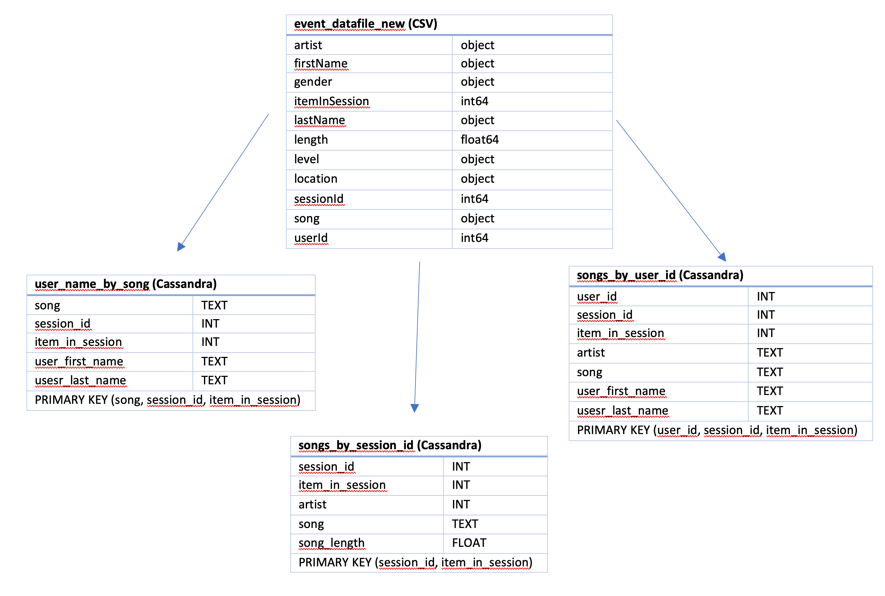

# Data Engineering Nanodegree Project 2: Data Modeling with Apache Cassandra

An Apache Cassandra Database Schema and ETL pipeline for a fictional song streaming service named Sparkify.
The service is predominantly aimed to assist the analytics team in understanding what songs users are listening to.

## Motivation 
Sparkify has been collecting song and user activity on their music streaming app. Currently, the data resides in a cvs file. There are 3 particular set of queries that the database should be optimized to answer:
1. Get the artist, song title and song's length in the music app history that was heard during a particular (sessionId, itemInSession)
2. Give me only the following: name of artist, song (sorted by itemInSession) and user (first and last name) for a given (userid, sessionid)
3. Give me every user name (first and last) in my music app history who listened to a particular song. 

## How to Use?
You can find a step by step implementation in _Project_1B_Project_Template.ipynb_

## Project Structure
```
├── event_data                          <- Data Files
├── images                              <- Images used in the notebook
├── event_datafile_new.csv              <- Data table that concentrates all the data of even_data in a single csv file
├── Project_1B_Project_Template.ipynb   <- Notebook with a step be step example of the ETL process
└── README.md                           <- That's me! Repository overview
```

## Database Schema

